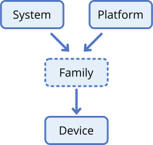

= Notes about devices
include::_support/common.inc[]
:fn-soc: footnote:[link:https://en.wikipedia.org/wiki/System_on_a_chip[System on a Chip]]

[.right.image-halfwidth]

This document describes the terms used to describe a *device* within Mobile
NixOS.

The terms are:

* Device
* (Family)
* Platform
* System

[.clear-floats]
== Definitions

=== What is a _system_?

A *system* describes the common peculiarities that are shared across the
different _devices_ and _platforms_. Options may be present to describe
systemic differences or evolutionary changes in those systems' design.

Generally, a system describes the most basic requirements to boot devices,
without caring for details that are _platform_-specific or _device_-specific.

When talking about a _system_, they are commonly referred as _$system-based_.
For example, `asus-z00t` is an *android-based* system. Its `system.type` is
`android`.

Examples of systems:

* android-based (most devices shipping with Android)
* depthcharge-based (most devices shipping with ChromeOS)
* u-boot-based (a wide range, but mostly "hackable" hardware)

=== What is a _platform_?

A *platform* describes the common features of a _SoC_{fn-soc} disregarding the
_system_ it is used with. It is entirely expected that a single _platform_ is
used with a variety of _systems_.

The _platform_ should set as few global options as possible, the most likely,
and lone, option set should be the _system_ used (e.g. `aarch64-linux`). A
_platform_ will also toggle _quirks_ on and off, which are deficiencies
that must be worked around specific to the _platform_.

Lastly, as an implementation detail, it is preferred to keep the platforms _as
precisely as possible_, making a distinct platform even if it is technically
the same as another one (e.g. _Rockchip RK3399_ ⇆ _Rockchip OP-1_). This allows
better differentiation if, in the end, there is a tiny difference.

The names used should be the _technical_ names, as best as possible. This is
why the _Qualcomm Snapdragon 615_ is named _Qualcomm MSM8939_.

Examples of platforms:

* Allwinner A64
* Qualcomm MSM8939
* Qualcomm SDM660
* Rockchip OP-1

=== What is a _device_?

A *device* is a _somewhat specific_ description of a model of an _appliance_ or
a _machine_. Generally speaking, when a single build boots on two different
_SKUs_ without differentiation, they are the same _device_.

The `oneplus-oneplus3` and `oneplus-oneplus3t` is a single _device_.
Conversely, the `google-taimen` and `google-walleye` are _distinct devices_
requiring a different kernel build (or software handling via kernel modules).
The actual line where devices stop being devices and start becoming families is
undefined, and undefinable. Though following _the same kernel build boots them_
is likely a good differentiator.

When describing a device, a device is made by or for an _OEM_ (e.g. ASUS,
Google), has a _name_ (e.g. Zenfone 2 Laser, Pixel 2), and generally has a
_codename_ (e.g. z00t, walleye). When talking about a device, it's better to
use the _$oem-$codename_ pair (e.g. `asus-z00t`), as it describes the exact
device more appropriately. Some OEMs re-use device names (e.g. Moto G).
Additionally, those codenames are generally used to talk about the devices
with Android ROM development, it ends up being useful to find resources about
the device.

Examples of devices:

* ASUS Zenfone 2 Laser (`asus-z00t`)
* Google Pixel 2 (`google-walleye`)

=== What are _families_?

First of all, *families* are optional. Most devices will directly be
implemented without a family in sight.

A family is best described as an _incomplete device_. Most of the device's
properties will be defined by the family, and only the last details will be
described by the device.

Following from the previous example, `google-walleye` and `google-taimen` are
different _devices_ of the same _family_. They both are made by the same OEM,
and share most configuration. The main differences here are the display size,
and the kernel build used.

Examples of families:

* `google-wahoo`, the Pixel 2 (`taimen` and `walleye`)

== Implementation

=== Do I need to implement a system type?

Probably not. You only need to implement a system type when your device has a
different boot chain not supported already.

If you do end up needing to implement a system type, they are under the
`modules/system-types` directory.

=== How do I implement a platform?

First, you need to know whether you need to add a platform or not. All distinct
SoCs need their own option, see `modules/hardware-$manufacturer.nix`.

Look at existing platforms implemented, and copy the one that matches yours the
best. It is likely you only need to add an option to enable the platform, an
option for the system type, and enable the relevant quirks.

=== How do I implement a device?

See the <<../porting-guide.adoc#,Porting Guide>>.

=== How do I implement a family?

The easiest way is to implement two devices of your family, copy-paste and all,
and only after refactor the common parts out.

Families are found under the `devices/families` directory, one directory per
family. They should mirror the implementation of a device, but be incomplete,
expected to be completed by their devices.

== Implementation details

=== Families

Families are not a module, like systems and platforms, as they would incur
additional cost during the evaluation for not much gain. Seen in another way,
families are an implementation detail of a device, and not an intrinsic part of
the architecture of the Mobile NixOS project.
